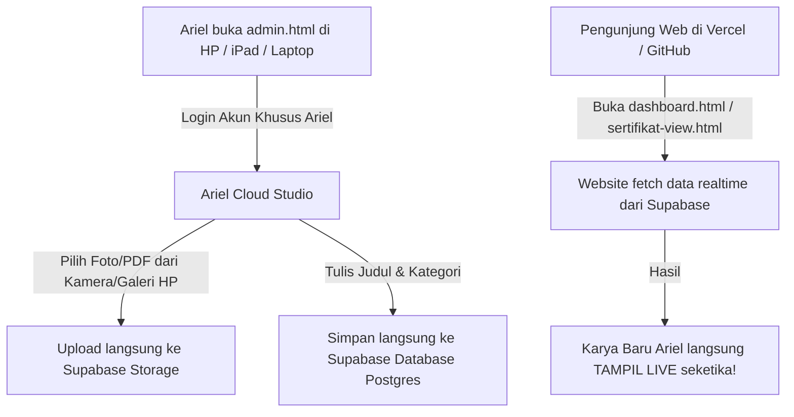

# 🚀 Panduan Otomasi Penuh: Vercel + Supabase Cloud untuk Ariel Usman

Sistem ini telah dirancang **100% otomatis, responsif untuk Smartphone/Tablet/Laptop**, dan **tidak memerlukan upload atau pengeditan file JavaScript secara manual** setiap kali Anda mengunggah portofolio, sertifikat, atau berkas baru.

---

## 📱 Alur Kerja Otomasi (Smartphone, Tablet & Komputer)

---

## 🛠️ Langkah Setup Supabase (Hanya 1 Kali Saja)

### 1. Buat Proyek Supabase
1. Kunjungi [https://supabase.com/](https://supabase.com/) dan buat proyek baru (misal: `ariel-portfolio`).
2. Masuk ke menu **SQL Editor** di dashboard Supabase.
3. Buka file [`supabase_schema.sql`](supabase_schema.sql), salin seluruh isinya, dan klik **Run**.
   > *Query ini akan otomatis membuat tabel `projects`, `certificates`, `important_files`, `contacts`, bucket storage, serta mengisinya langsung dengan seluruh 99 portofolio & sertifikat asli Anda.*

### 2. Dapatkan Kunci API
1. Buka menu **Project Settings** -> **API** di Supabase.
2. Salin **Project URL** dan **Anon Public Key**.

### 3. Masukkan Kunci ke Studio (Lewat HP atau Komputer)
1. Buka halaman [`admin.html`](admin.html) di browser Anda.
2. Masuk dengan akun khusus Anda:
   - **Username**: `arielusman` *(atau email: `madeaircun@gmail.com`)*
   - **Password**: `ArielMadeAI2026!`
3. Klik tombol **Kunci API** (ikon kunci) di pojok kanan atas, tempel **Project URL** dan **Anon Key**, lalu klik **Simpan & Hubungkan**.
4. Status akan langsung berubah menjadi: 🟢 **Supabase Cloud Aktif**.

---

## 🌐 Deploy ke Vercel (Otomatis & Gratis)

1. Pastikan seluruh file sudah di-push ke repository GitHub Anda (`arielrifkycahyadi.github.io`).
2. Masuk ke [https://vercel.com](https://vercel.com) dan klik **Add New Project**.
3. Pilih repository GitHub Anda.
4. Framework Preset: **Other** *(karena sudah ada [`vercel.json`](vercel.json))*.
5. Klik **Deploy**.
6. Selesai! Website Anda langsung aktif di domain Vercel (misal: `https://ariel-portfolio.vercel.app`).

---

## 📲 Cara Unggah dari Smartphone atau Tablet

1. Buka `https://domain-anda.vercel.app/admin` di browser HP (Safari iOS, Google Chrome Android).
2. Masuk dengan akun Anda.
3. **Unggah Portofolio**:
   - Ketik judul, pilih kategori, isi link URL / GDrive.
   - Ketuk tombol **"Pilih Foto / Gambar"** untuk mengambil foto langsung dari kamera HP atau memilih dari galeri.
   - Ketuk **"Publikasikan Portofolio"**.
4. **Unggah Sertifikat**:
   - Ketik nama sertifikat & instansi penerbit.
   - Ketuk **"Pilih File PDF / Gambar"** untuk memilih berkas dari dokumen HP.
   - Ketuk **"Simpan & Unggah Sertifikat"**.
5. **Selesai!** Website langsung terupdate secara otomatis dan realtime tanpa perlu mengetik kode, membuka terminal, atau commit Git.
